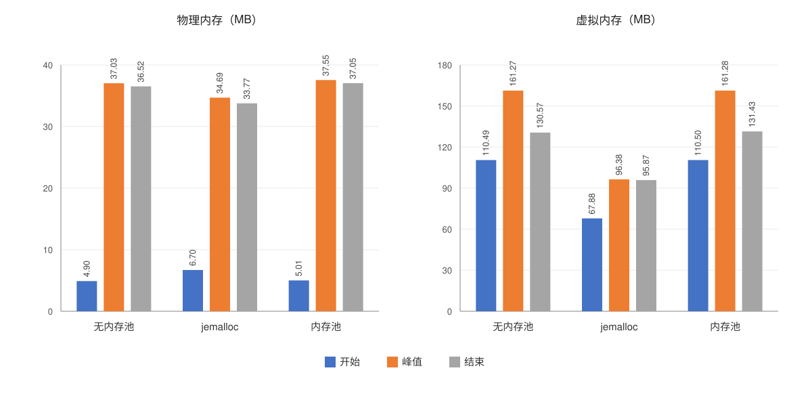

# kvstore

一个基于 RESP 协议、支持四种内存存储引擎、主从复制与 RDB/AOF 持久化的 KV 服务端项目。

## 功能特性

- **网络后端**：reactor(epoll)、proactor(io_uring)、NtyCo 协程三种实现全部编入同一个二进制，
  运行时通过配置文件或 `--network` 选择，切换后端不需要重新编译。
- **存储引擎**：array、rbtree、hash、skiptable，各自一套 `SET/GET/DEL/MOD/EXIST` 风格命令。
- **内存分配**：业务代码统一走 `kvs_malloc` / `kvs_calloc` / `kvs_free`，由编译期宏
  `ENABLE_MEMORYPOOL` 决定使用内置 slab 内存池还是系统 `malloc` / `free`。
- **协议**：外层 4 字节长度前缀帧 + 内层 RESP 数组/批量字符串，支持半包与粘包。
- **持久化**：RDB 全量快照 + AOF 增量日志，启动后不自动恢复，需命令手动触发。
- **复制**：主从握手、全量同步（TCP，可选 RDMA）、增量同步（eBPF 采集 + backlog + 发送线程）。

## 目录结构

```text
.
├── CMakeLists.txt          # 构建配置：服务端与测试客户端一起构建
├── kvstore.cpp             # 入口、RESP 解析、命令分发
├── kvstore.conf            # 默认配置文件
├── include/                # 公共头文件与编译期开关
├── config/                 # 配置文件解析
├── network/                # reactor / proactor / ntyco 三种网络后端
├── storage/                # array / rbtree / hash / skiptable
├── memorypool/             # 内置 slab 内存池
├── persistence/            # snapshot（RDB）与 aof
├── replication/            # 主从复制、eBPF 采集、RDMA
├── testcase/               # 测试客户端源码、测试方案与一键脚本
├── data/                   # 运行时持久化文件目录
├── docs/                   # 内存对比图表与生成脚本
├── NtyCo/                  # Git submodule，第三方协程库
└── readme.md
```

## 编译与运行

### 1. 依赖

必需：

- CMake 3.10+、C/C++ 编译器、pthread
- liburing（构建期必需）
- NtyCo（通过 Git submodule 接入）

可选：

- jemalloc：CMake 默认未强制链接；关闭内存池（`ENABLE_MEMORYPOOL=0`）时可作为系统分配器。
- libibverbs / librdmacm：能找到时自动启用 RDMA 全量同步（定义 `KVS_ENABLE_RDMA`），
  否则退化为纯 TCP 全量同步。

Ubuntu/Debian 安装依赖：

```bash
sudo apt-get update
sudo apt-get install -y build-essential cmake liburing-dev libjemalloc-dev
```

### 2. 获取源码与 NtyCo 子模块

首次克隆：

```bash
git clone --recurse-submodules <repo-url>
```

已有仓库：

```bash
git submodule sync --recursive
git submodule update --init --recursive

# 或执行一键脚本，效果相同，可重复执行
./setup_submodule.sh
```

NtyCo 源码会随 `kvstore` 一起编译，不依赖 submodule 内生成的 `libntyco.a`，因此不需要手工
在 `NtyCo/` 下执行 `make`。如果 `NTYCO_ROOT` 指向的目录里没有 `core/nty_coroutine.h`，
CMake 会在配置阶段直接报错并提示先初始化子模块。

### 3. 编译步骤

```bash
cd /path/to/kvstore
git submodule sync --recursive
git submodule update --init --recursive
cmake -S . -B build
cmake --build build -j$(nproc)
```

编译产物：

- 服务端：`build/kvstore`
- 测试客户端：`build/testcase/{AOF,RDB,test,master-replica,memorypool}/...`

需要自定义 NtyCo 路径时：

```bash
cmake -S . -B build -DNTYCO_ROOT=/path/to/NtyCo
```

> 历史文档中出现过的 `-DURING_ROOT` 未在 `CMakeLists.txt` 中定义，请改用 `-DNTYCO_ROOT`。

### 4. 运行

> 持久化路径在代码中是 `../data/kvstore.data` 和 `../data/append.aof`（相对进程工作目录），
> 因此必须从 `build/` 目录启动服务，否则会写到错误的位置。

位置参数形式：

```bash
./kvstore <监听端口> <角色> [主节点IP] [主节点端口]
```

角色 `0` 为 Master，`1` 为 Replica。

```bash
cd build

# Master，监听 9999
./kvstore 9999 0

# Replica，监听 10001，连接 Master 的 9999
./kvstore 10001 1 127.0.0.1 9999
```

配置文件形式：默认依次尝试 `./kvstore.conf` 与 `../kvstore.conf`，也可用 `--config <path>`
显式指定。

```bash
cd build
./kvstore --config ../kvstore.conf
```

`kvstore.conf` 核心字段：

- `bind` / `port`：监听地址与端口。
- `log_level`：`debug`、`info`、`warn`、`error` 或 `off`。
- `role`：`master` 或 `replica`（也接受 `slave`、`0`、`1`）。
- `master_ip` / `master_port`：角色为 `replica` 时连接的主节点地址与端口。
- `persistence_mode`：`none`、`rdb`、`aof` 或 `both`；也可用 `rdb on/off`、`aof on/off`
  分别控制。默认为 `none`，需要持久化时再显式打开。
- `network_architecture`：`reactor`（或 `epoll`）、`ntyco`（或 `coroutine`）、
  `proactor`（或 `io_uring`），默认 `ntyco`；启动时确定，运行期间不能切换。

命令行开关可以覆盖配置文件中的值，旧的位置参数方式仍然兼容：

```bash
./kvstore --config ../kvstore.conf --port 7000 --role replica \
  --master-ip 127.0.0.1 --master-port 9999 --persistence-mode aof \
  --network reactor
```

只想临时切换一次网络后端时，可以不改配置文件：

```bash
./kvstore --network reactor
./kvstore --network ntyco
./kvstore --network proactor
```

## 测试方案与可行性

### 测试环境

- 单机验证：服务从 `build/` 目录启动，测试客户端连接 `127.0.0.1`。
- 协议：外层 4 字节长度前缀帧 + 内层 RESP 负载，客户端实现见 `testcase/testcase.h`。
- 前置条件：已完成编译，`build/kvstore` 与对应 `build/testcase/...` 客户端存在，
  `data/` 目录可写。
- 持久化用例依赖 io_uring（RDB/AOF 均通过 io_uring 读写文件）；容器或受限沙箱若禁用了
  `io_uring_setup`，会表现为 `AOF init failed` 或写快照失败，需要在支持 io_uring 的环境运行。

### 测试用例与结果

| 用例 | 测试代码 | 执行方式 | 验证点 | 结果 |
| --- | --- | --- | --- | --- |
| AOF 增量恢复 | `testcase/AOF/{save,load}.cpp` | `testcase/run_aof_cycle.sh` | `AOF CLEAR` 后写入 10 万条，重启服务 `AOF LOAD` 后数据完整 | 已通过 |
| RDB 全量恢复 | `testcase/RDB/{save,load}.cpp` | `testcase/run_rdb_cycle.sh` | 写入 10 万条 → `RDB SAVE` → 重启服务 → `RDB LOAD` 后数据完整 | 已通过 |
| 主从全量 + 增量同步 | `testcase/master-replica/*.cpp` | 手动分步执行（见下） | 先写 5 万条启动 Replica 做全量同步，再写 5 万条走增量，Replica 读到 10 万条 | 已通过 |
| 单引擎命令回归 | `testcase/test/testcase.cpp` | `build/testcase/test/test 127.0.0.1 9999 <mode>` | 四引擎 `SET/GET/DEL/MOD/EXIST` 及异常响应 | 可扩展执行 |
| 内存池对比 | `testcase/memorypool/*.cpp` | `memptest` / `memptest_pthread` + `monitor_mem.sh` | 内存占用与并发稳定性 | 已采集，见「性能数据」 |

### 一键执行持久化用例

```bash
cd /path/to/kvstore

# AOF：写入 10 万条 -> 重启服务 -> AOF LOAD -> 校验
./testcase/run_aof_cycle.sh

# RDB：写入 10 万条 -> RDB SAVE -> 重启服务 -> RDB LOAD -> 校验
./testcase/run_rdb_cycle.sh
```

两个脚本都会自动从 `build/` 启动服务、等待端口就绪、运行保存/加载客户端，并用 SIGINT
优雅停服。输出 `... cycle completed.` 表示用例通过；客户端断言失败会以非零状态码退出。

### 主从同步用例（手动）

```bash
cd build

# 1. 启动 Master，并写入前 5 万条
./kvstore 9999 0 &
./testcase/master-replica/insert_before5w 127.0.0.1 9999

# 2. 另开终端启动 Replica，触发全量同步
./kvstore 10001 1 127.0.0.1 9999 &

# 3. 向 Master 写入后 5 万条，触发增量同步
./testcase/master-replica/insert_after5w 127.0.0.1 9999

# 4. 在 Replica 上校验 10 万条（前 5 万全量 + 后 5 万增量）
./testcase/master-replica/get10w 127.0.0.1 10001
```

每 5 万条按四种引擎均分（`SET`/`RSET`/`HSET`/`SSET` 各 12500 条），`get10w` 会逐条比对，
失败时打印 `==> FAILED ...`。

### 单引擎命令回归（可选）

```bash
cd build
# mode：0 rbtree，1 array，2 hash，3 skiptable
./testcase/test/test 127.0.0.1 9999 1
```

### 可行性结论与已知局限

可行性：

- 三个同步/持久化用例已在单机环境验证通过，可通过上述脚本与客户端复现。
- 用例只依赖编译产物，无外部服务依赖；`build/kvstore` 与测试客户端由同一次 CMake 构建生成。

已知局限：

- 目前均为单机功能正确性验证（10 万数据量级），不构成压力/稳定性测试。
- 未覆盖多机部署、网络分区、故障注入、慢副本断开与重连等异常场景。
- 主从同步用例需手动分步执行，暂无一键脚本。
- RDB 记录长度依赖 `strlen`，不支持嵌入 NUL 的 key/value，也不支持跨主机字节序移植。
- AOF 批量落盘，进程被强制杀死时可能丢失未达刷新阈值的缓冲数据。

待补充专项测试：eBPF 实时增量路径、RDMA 全量同步、断线重连与退避，以及 reactor / proactor /
ntyco 三种后端的一致性对比。

## 性能数据

> 目前只有内存占用实测数据，吞吐、延迟等指标待补充。

### 内存占用（实测）

比较无内存池、jemalloc 和内置内存池三种配置在开始、峰值、结束时的内存占用，单位为 MB。
左图为物理内存，右图为虚拟内存；每组柱子顺序为「开始 / 峰值 / 结束」。两图数据量级不同，
各自使用独立纵轴，柱高不可跨图直接比较。



| 配置 | 物理内存（开始 / 峰值 / 结束） | 虚拟内存（开始 / 峰值 / 结束） |
| --- | ---: | ---: |
| 无内存池 | 4.90 / 37.03 / 36.52 | 110.49 / 161.27 / 130.57 |
| jemalloc | 6.70 / 34.69 / 33.77 | 67.88 / 96.38 / 95.87 |
| 内存池 | 5.01 / 37.55 / 37.05 | 110.50 / 161.28 / 131.43 |

数据由 `monitor_mem.sh` 采样 RSS/VmSize 得到，图表由 `docs/gen_memory_chart.py` 生成：

```bash
./monitor_mem.sh --duration 30 --output /tmp/kvstore_mem.csv 9999 0
python3 docs/gen_memory_chart.py
```

## 通信协议与命令

服务端采用两层协议，客户接入时务必保持一致：

1. 外层是长度前缀帧：4 字节网络字节序无符号长度，后跟该长度的负载。
2. 内层负载是 RESP 数组/批量字符串格式，例如：

```text
*3\r\n
$3\r\nSET\r\n
$3\r\nkey\r\n
$5\r\nvalue\r\n
```

请求和响应都使用同样的帧格式；一次负载可包含多条命令（粘包），三个网络后端都实现了半包处理。
消息体上限 `MAX_ALLOWED_LEN` 为 1MB，超限会被拒绝或断开连接。

命令表见 `kvstore.cpp` 的 `command[]` 与 `enum KVS_CMD`：

- array：`SET GET DEL MOD EXIST`
- rbtree：`RSET RGET RDEL RMOD REXIST`
- hash：`HSET HGET HDEL HMOD HEXIST`
- skiptable：`SSET SGET SDEL SMOD SEXIST`
- 持久化：`RDB SAVE`、`RDB LOAD`、`AOF LOAD`、`AOF CLEAR`

> `RDB SAVE`、`AOF LOAD` 等带空格的命令是一个整体 token，不是两个参数。

响应约定：

- 写成功 `+OK\r\n`，键已存在 `+EXIST\r\n`，错误 `-ERROR\r\n`。
- `GET` 成功返回批量字符串；键不存在返回 `$8\r\nNO EXIST\r\n`。
- `DEL` / `MOD` 不存在返回 `$8\r\nNO EXIST\r\n`。
- `EXIST` 存在返回 `$5\r\nEXIST\r\n`，不存在返回 `$8\r\nNO EXIST\r\n`。

## 主从复制与同步

- 从节点只需指定主节点地址与端口，连接、握手、全量同步、断线重连都在后台监督线程完成；
  Master 尚未启动时从节点也能正常启动，并按指数退避持续重试。
- 每次写成功都会把 RESP 命令追加到全局增量日志 backlog（带递增序号），由独立发送线程按每个
  Replica 的 `next_seq` 用 `MSG_DONTWAIT` 投递，事件循环不做阻塞发送。
- 全量同步复用 `kvs_snapshot_serialize()` 的 RDB 二进制内容分片下发，快照与 backlog 序号在同一把
  存储锁内确定，因此全量同步期间落地的写命令不会丢失，也不会重复。
- 超过 30 秒没有发送进展的慢副本会被断开，由 Replica 重连后重新全量同步，不会阻塞 Master。
- 复制帧负载首字节是类型字段（增量命令 / RESET / 快照分片 / 快照结束 / 全量完成），定义见
  `include/kvs_replication.h`。
- `RDB LOAD` / `AOF LOAD` 成功后会对在线 Replica 重新发起全量同步。
- fd 生命周期归网络层：复制模块只 `shutdown()` 触发断开，由网络层 `close()` 并回调
  `kvs_replication_remove_replica()`，避免 fd 复用后复制帧写进普通客户端连接。
- 存储引擎没有内部锁，所有访问都经过 `kvstore.cpp` 的可重入存储锁；锁顺序固定为
  存储锁 → 复制锁（`g_repl_mutex`），不得反向获取。

## RDMA 全量同步（可选）

编译时能找到 libibverbs/librdmacm 会定义 `KVS_ENABLE_RDMA`，此时：

- Master 在 `监听端口 + 1` 上额外开一个 RDMA 监听（如 TCP 9999 → RDMA 10000）。
- Replica 每次（重）连接先尝试用 RDMA 拉全量快照，成功后再发 TCP 握手；Master 记录该快照
  对应的 backlog 序号，握手时只补发序号之后的增量。RDMA 只承担一次性大批量搬运，实时增量
  始终走 TCP。
- 任何一步失败都会回退 TCP 全量快照，并在日志中打印失败步骤，例如
  `[RDMA] full sync 失败于步骤「rdma_resolve_addr」: errno=22(Invalid argument)`。

用软件 RDMA 验证：

```bash
sudo ./setup_rdma.sh          # 默认在 ens33 上创建 SoftiWARP 链路 siw1
rdma link show                # 应显示 siw1/1 state ACTIVE
```

注意事项：

- `rdma link add` 创建的 SoftiWARP 链路不持久化，重启后需重新执行 `setup_rdma.sh`。
- Replica 的 `master_ip` 必须是 RDMA 网卡 IP（例如 `192.168.234.135`），**不能用 127.0.0.1**，
  RDMA 无法 resolve 回环地址（`rdma_resolve_addr` 返回 EINVAL）。
- 同机部署时注意端口冲突：Master 的 RDMA 端口是「主节点端口 + 1」。
- 实现使用「普通 `IBV_WR_RDMA_WRITE` + 一条 SEND 通知」，不要改回
  `IBV_WR_RDMA_WRITE_WITH_IMM`：SoftiWARP 下带立即数的写会在 `ibv_post_send` 返回 ENOSPC(28)。
- `siw` 是软件 RDMA（底层仍走 TCP/IP），吞吐不会优于 TCP，主要用于在没有 RDMA 硬件的环境
  跑通代码路径；真实性能收益需要 RoCE 等硬件。

## eBPF 实时增量采集

实时增量默认由 eBPF 采集（`KVS_ENABLE_EBPF_REALTIME=1`），链路为：

```text
Master 写路径（持有存储锁）
  -> kvs_ebpf_notify_write(seq, argc, argv)      uprobe 挂载点
  -> BPF_PROG_TYPE_KPROBE 程序读取 argv，写 BPF_MAP_TYPE_RINGBUF
  -> 用户态消费线程解析记录、校验序号
  -> backlog（增量日志）+ 发送线程
  -> TCP / RDMA 投递给 Replica
```

关键点：

- **跨主机可用**：eBPF 只负责本机采集，跨主机投递仍走 TCP/RDMA，不要求 Master/Replica 同内核。
- **为什么是 uprobe**：kprobe 只能挂内核函数，读不到应用层参数，也会在 proactor(io_uring) 后端
  下漏事件；uprobe 触发在 kvstore 自身写路径上，三个后端都能采集。
- **丢事件可检测**：ringbuf 的 `reserve` 在队列满时会失败，记录带自增序号，消费线程一旦发现
  序号缺口就打印错误并触发全量重同步，绝不静默丢命令。
- **不截断命令**：单条命令最多 3 个参数、每个参数最多 `KVS_EBPF_EVENT_ARG_MAX`(1024) 字节；
  超限命令不采集，由写路径直接落 backlog，并在落之前等采集通道排空，保证顺序不变。
- **快照对齐**：取全量快照前会等采集通道排空（最多 200ms），保证 `base_seq` 与快照内容对齐。
- **自动回退**：任何 attach 失败（缺 `CAP_BPF`、tracefs 不可写、内核不支持 ringbuf 等）都只影响
  「命令怎么进 backlog」，写路径退回直接落 backlog，功能与一致性不受影响。

### 依赖与内核要求

- 仅支持 Linux x86_64；直接调用 `bpf(2)`，不依赖 libbpf/clang/bpftool，也不需要 bpffs。
- 需要内核支持 `BPF_MAP_TYPE_RINGBUF`（Linux 5.8+）及 `bpf_probe_read_user_str` 等 helper。
- 需要 `CAP_BPF`（或 `CAP_SYS_ADMIN`）、`CAP_PERFMON`（或 `CAP_SYS_ADMIN`）；写 tracefs 的
  `uprobe_events` 需要 root 权限（内核提供 uprobe PMU 时不需要 tracefs）。

### 运行前配置与验证

```bash
# 检查内核版本、uprobe/tracefs、perf_event_paranoid、capability
./setup_ebpf.sh --check

# 给编译产物加 capability（或直接用 root 运行）
sudo setcap cap_bpf,cap_perfmon,cap_sys_admin+ep ./build/kvstore
```

> **每次 `cmake --build` 之后都要重新执行 `./setup_ebpf.sh`**：内核会在文件被写入时清除
> `security.capability`，此时启动会打印 `create ringbuf map failed ... Operation not permitted`
> 并回退直写 backlog，而不是报错退出。

采集通道生效时，Master 启动日志会出现：

```text
[EBPF] uprobe attached: /path/to/kvstore:0x...
[EBPF] realtime capture active: uprobe ringbuf -> replication backlog (cross-host OK)
[REPLICATION] realtime increments captured by eBPF ringbuf
```

不具备 eBPF 能力时（容器/CI）会自动回退，也可用模拟构建验证整条链路：

```bash
cmake -S . -B build-sim -DCMAKE_CXX_FLAGS=-DKVS_EBPF_SIM -DCMAKE_C_FLAGS=-DKVS_EBPF_SIM
cmake --build build-sim -j$(nproc)
```

该构建把内核部分换成等价的用户态 ringbuf（记录格式与消费代码完全一致），启动日志会显示
`[EBPF] simulation mode: ...`。

### 常见故障排查

| 现象 | 常见原因 | 处理方式 |
| --- | --- | --- |
| 重新编译后 `create ringbuf map failed` EPERM | 内核在文件被写入时清除了 `security.capability` | 重跑 `./setup_ebpf.sh`（每次 build 后都要） |
| `create ringbuf map failed` EPERM | 缺少 `CAP_BPF`/`CAP_SYS_ADMIN` | 重新 `setcap`，或直接用 root 运行 |
| `tracefs not writable` | 容器未暴露 `/sys/kernel/tracing` / debugfs | 授权 tracefs；否则退化为直写 backlog |
| `load kprobe program failed` 且带 verifier 日志 | 内核过老 / helper 不可用 | 查看 verifier 输出；升级内核或接受回退 |
| `perf_event_open failed` EPERM | `perf_event_paranoid` 过高或缺 `CAP_PERFMON` | 调整 `kernel.perf_event_paranoid` 或补 capability |
| 日志出现 `ringbuf lost N event(s)` | 采集通道丢事件（ringbuf 满） | 已自动触发全量重同步；频繁出现可调大 `KVS_EBPF_RINGBUF_SIZE` |

## 数据持久化与恢复

服务启动后不会自动加载持久化数据，需要通过命令手动触发恢复。持久化路径在代码中写死为
`../data/kvstore.data`（RDB）和 `../data/append.aof`（AOF），所以必须从 `build/` 目录启动。

### RDB 全量恢复

- `RDB SAVE`：把四种存储引擎的当前状态序列化为全量快照 `data/kvstore.data`。
- `RDB LOAD`：先清空现有数据，再从快照恢复；完成后会对在线 Replica 重新全量同步。

### AOF 增量恢复

- 正常写入时（非 AOF 恢复、非 Replica 重放阶段）会把写命令追加到 `data/append.aof`。
- `AOF LOAD`：读取并重放 `append.aof` 中的写命令；完成后会对在线 Replica 重新全量同步。
- `AOF CLEAR`：刷新缓冲并以 `w` 模式重新打开文件，清空日志。
- AOF 采用批量落盘，进程被强杀时最多丢失未达刷新阈值的内存缓冲数据；优雅关闭或执行
  `AOF LOAD` / `AOF CLEAR` 会先刷新缓冲区。

### 常见排查提示

- 找不到持久化文件：确认进程工作目录是 `build/`。
- 服务启动或 `LOAD` 时段错误：快照格式、`kvs_reset_data()` 或存储引擎 destroy 逻辑可能有问题；
  修改这些代码后至少执行一次 `RDB SAVE` / `RDB LOAD` 回归。

## 常见问题

**构建时提示 NtyCo 缺失**

```bash
git submodule sync --recursive
git submodule update --init --recursive
```

报 `nty_coroutine.h: No such file or directory` 说明子模块未初始化；按上述命令同步即可。

**找不到 liburing / jemalloc**

```bash
sudo apt-get install -y liburing-dev libjemalloc-dev
```

liburing 是构建期必需依赖。内存分配由 `include/memorypool.h` 的 `ENABLE_MEMORYPOOL` 决定：
置 `1` 时 `kvs_malloc` / `kvs_calloc` / `kvs_free` 走内置 slab 内存池，置 `0` 时走系统
`malloc` / `calloc` / `free`；若构建时链接了 jemalloc，置 `0` 实际使用的是 jemalloc。

**需要指定依赖或 NtyCo 目录**

```bash
cmake -S . -B build -DNTYCO_ROOT=/path/to/NtyCo
```

**连接成功但响应异常**

先确认客户端是否按「4 字节长度头 + RESP 负载」收发，而不是直接发送裸 RESP；帧封装可参考
`testcase/testcase.h`。
